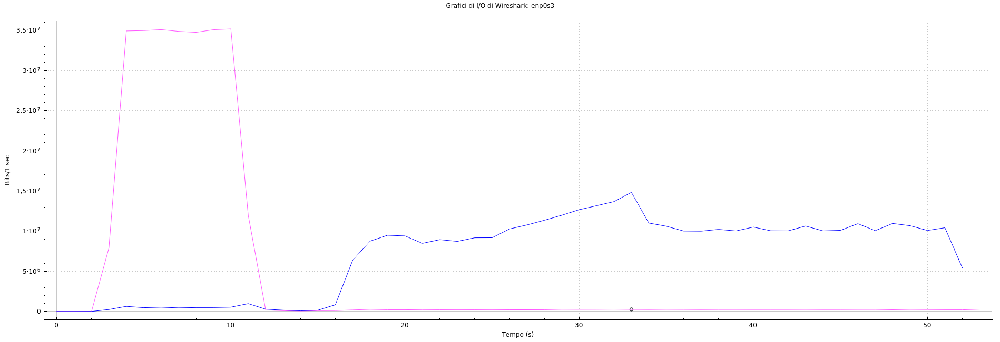

# Speedtest Analysis with wireshark
Since make an analysis into a local machine could lead to a bad evaluation of results due to other applications' network traffic noise, we made the analysis into a isolated environment like a virtual machine to avoid this noise, not coming from or going to fast.com.
For a further accuracy in the capture we set the `tcp` filter option in wireshark and after we run the speedtest. 

## Fast.com result

From this speedtest we focused into 2 informations: the download speed (34 Mbps) and the upload speed (8.1 Mbps).

## Wireshark analysis
During the speedtest we captured all traffic outgoing and ingoing from and to our machine including the one created by fast.com and it can be found in [this](fastcom_capture.pcap) pcap file.

To analyze the speedtest we opened the I/O Graph window from statistics menu and we added two filters: one for filtering the download traffic `tcp.srcport == 443` (the pink curve) and one for filtering the upload traffic `tcp.dstport == 443` (the blue curve).

## Results
From the wireshark analysis the curves describes with a good accuracy what fast.com says, in fact the upload curve in the chart oscillates around 35 Mbsp and the download around 9 Mbps.
In conclusion the wireshark estimation is very close to the fast.com speedtest result. 